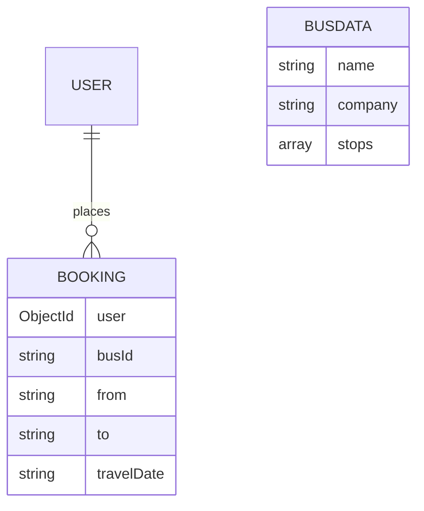

# Chapter 5 — Database design (MongoDB)

MongoDB is accessed through **Mongoose** ODM. Connection string is read from `config/default.json` under key `mongoURI` (default: `mongodb://127.0.0.1:27017/bus-booking`).

## 5.1 Collections overview

| Logical name | Mongoose model | Typical collection name* | Purpose |
|--------------|----------------|---------------------------|---------|
| User | `user` | **users** | Accounts, profile fields, legacy `ticket` array |
| Bus route | `busData` | **busdatas** | Operators, `stops` ordered list for search |
| Booking | `booking` | **bookings** | Saved trips per user after ticket step |

\*MongoDB pluralizes model names unless `collection` is set explicitly in schema.

## 5.2 Collection: `users` (User schema)

| Field | Type | Required | Description |
|-------|------|----------|-------------|
| name | String | Yes | Display name |
| email | String | Yes | Unique login identifier |
| password | String | Hashed | Stored with bcrypt |
| contact | String | No | Phone |
| dob | Date | No | Date of birth |
| gender | String | Yes | As per registration form |
| ticket | Array of Object | No | **Legacy** embedded ticket blobs (older flow); new flow uses `bookings` |
| date | Date | Auto | Document metadata default |

## 5.3 Collection: `busdatas` (Buses / `busData` model)

| Field | Type | Required | Description |
|-------|------|----------|-------------|
| name | String | Yes | Bus or service name |
| company | String | Yes | Operator name |
| stops | [String] | Yes | Ordered stops; **search** requires start city before end city in this array |
| date | Date | Auto | Creation timestamp |

**Search rule (see API):** API converts `start` and `end` to lowercase and matches documents where both appear in `stops` **in order** along the route.

## 5.4 Collection: `bookings` (Booking schema)

| Field | Type | Required | Description |
|-------|------|----------|-------------|
| user | ObjectId → `user` | Yes | Owner |
| busId | String | Yes | Selected bus id from UI (`selectedBusId` in localStorage) |
| from | String | No | Origin city text |
| to | String | No | Destination city text |
| travelDate | String | No | ISO date string from form |
| passengerNames | Mixed | No | Array or JSON string |
| seatNumbers | Mixed | No | Array or JSON string |
| totalAmount | Number | No | Computed on client (e.g. fare + tax) |
| paymentMethod | String | Default | e.g. "Credit Card" |
| status | String | Default | e.g. "confirmed" |
| createdAt | Date | Auto | Server booking time |

## 5.5 Entity relationship (conceptual)

Note: `busId` in `bookings` is stored as **string** reference to `busdatas._id`, not a Mongoose `ref` populate by default in the codebase.

---
