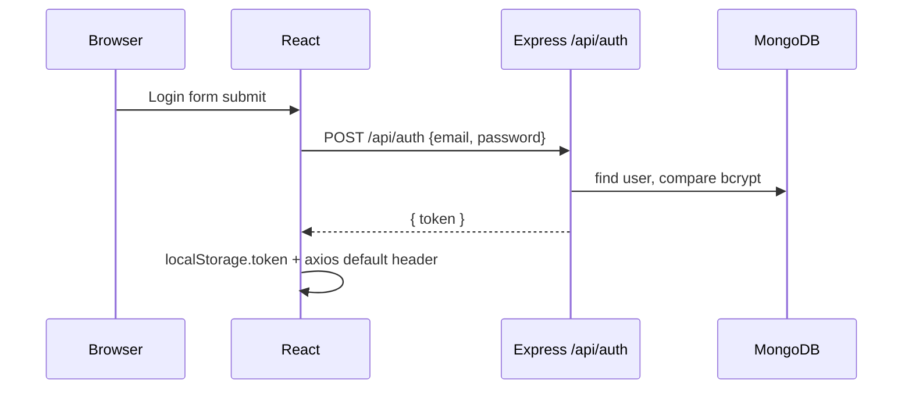
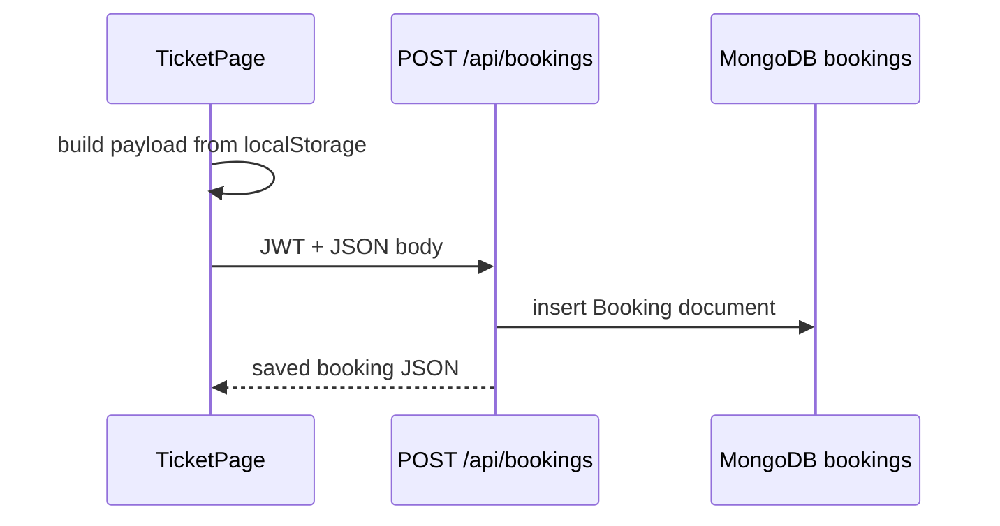

# Chapter 9 — Workflows and use cases

## 9.1 High-level booking workflow

```mermaid
flowchart LR
    A[Home /] --> B[Search /booking]
    B --> C[Select bus]
    C --> D[/book/menu1 Seat selection]
    D --> E[/book/menu2 Payment]
    E --> F[/book/ticket Ticket + save booking]
    F --> G[/my-bookings List]
```

## 9.2 Sequence: authentication



## 9.3 Sequence: save booking



## 9.4 Use case: search buses

| Step | Actor | System behaviour |
|------|--------|------------------|
| 1 | User | Enters start, end, date on `/booking` |
| 2 | User | Clicks Search |
| 3 | System | GET `/api/search/:start/:end` |
| 4 | System | Renders cards with Book Bus → `/book/menu1` |

## 9.5 Use case: view my bookings

| Step | Actor | System behaviour |
|------|--------|------------------|
| 1 | Logged-in user | Opens `/my-bookings` or Profile |
| 2 | System | GET `/api/bookings/me` |
| 3 | System | Renders table (same data on both pages) |

---
